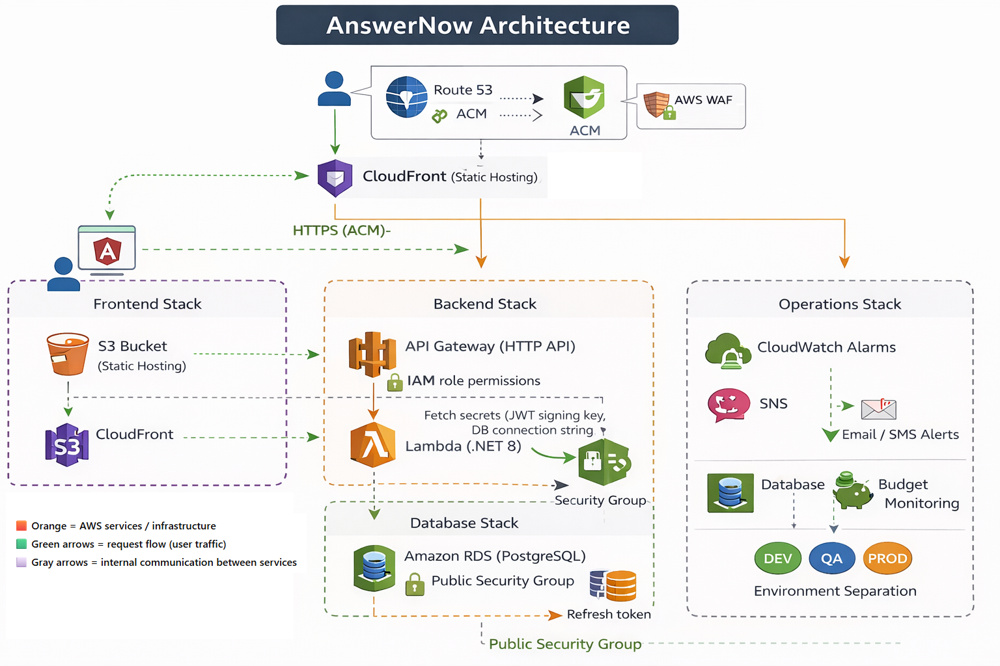
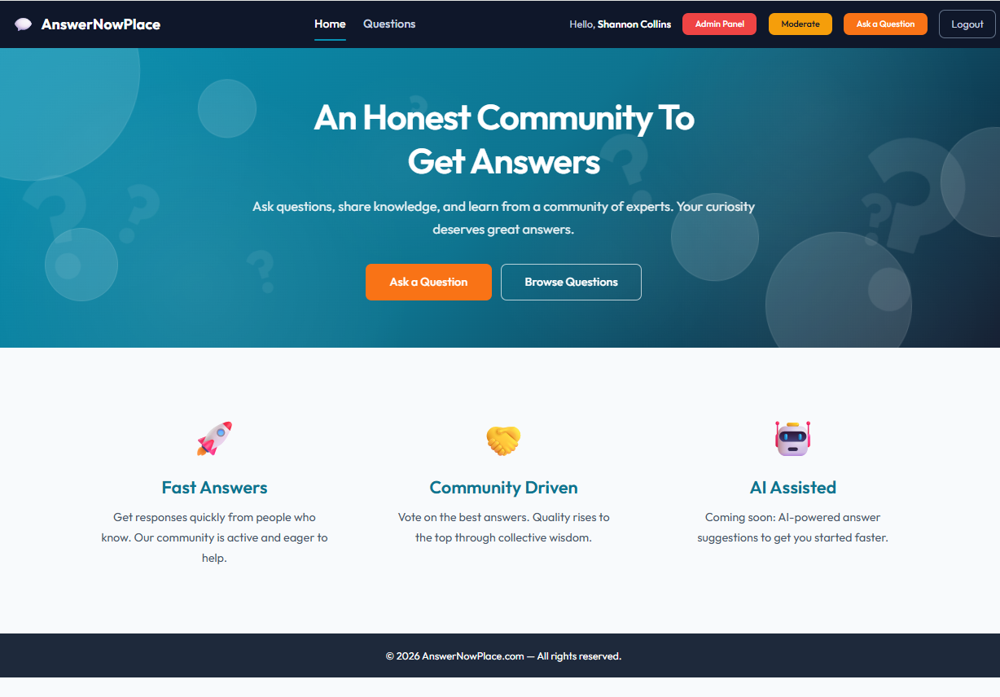
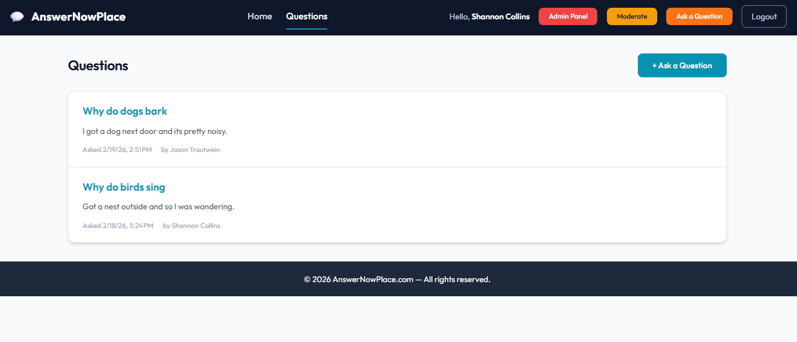
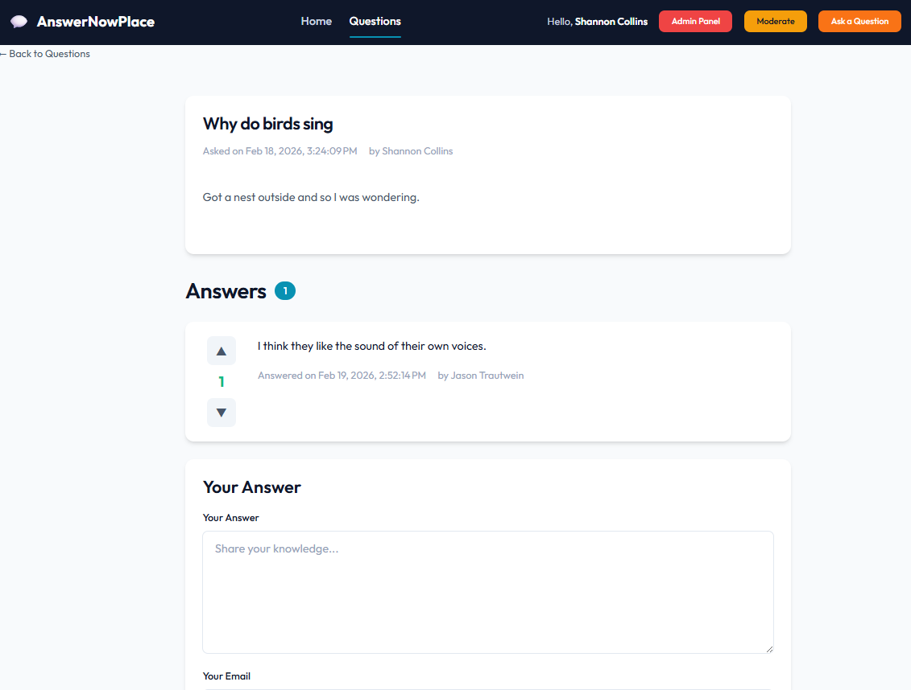
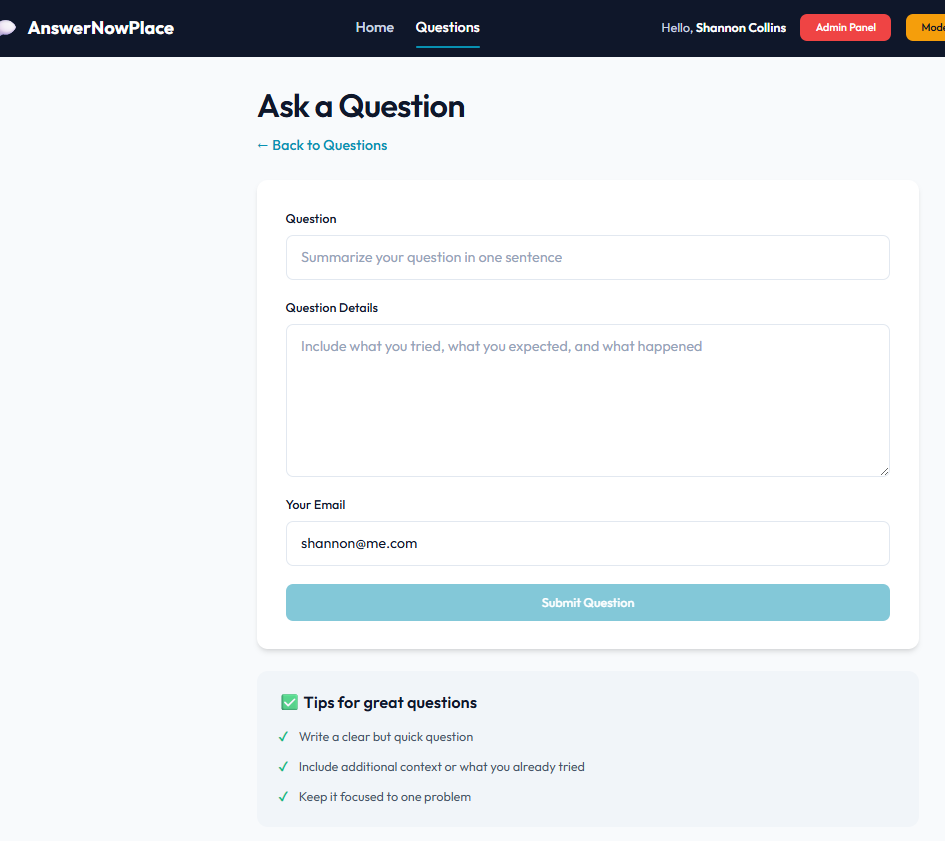
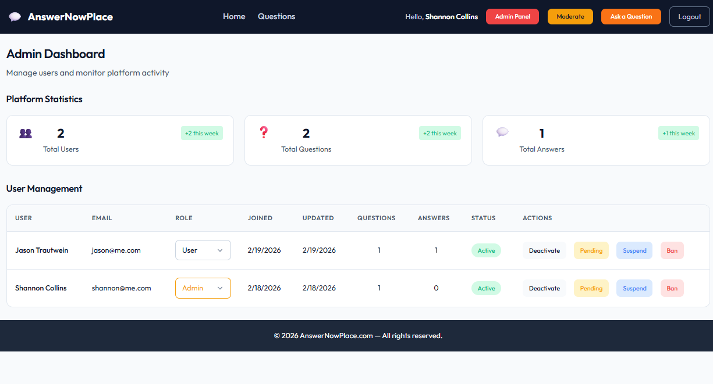
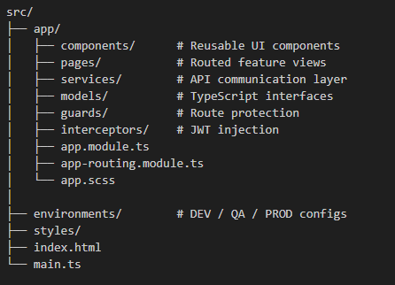

# AnswerNow UI Architecture

## Overview

AnswerNow UI is the Angular frontend for the AnswerNow full-stack Q&A platform.

It is designed to demonstrate:
- Modern Angular v20 architecture
- Environment-based configuration (DEV / QA / PROD)
- Secure JWT-based authentication handling
- Production-grade static hosting using AWS S3 + CloudFront
- Clean separation of UI, routing, and API integration concerns
- Real-world cloud deployment practice

---

## Architecture Diagram

---

The following screenshots demonstrate the deployed production UI and feature set.

## Application Snapshots

### Production Homepage

### Questions List View

### Question + Answer + Voting

### Submit Question Form

### Admin / Back Office Panel

---

# High-Level Architecture

## Local Development

Angular SPA  
→ ASP.NET Core API (.NET 8)  
→ PostgreSQL (Docker)

Notes:
- Angular runs locally on localhost:4200
- API runs locally or against DEV/QA/PROD cloud
- Environment files control API base URL
- No secrets are stored in source control

---

## AWS Production Deployment

# CloudFront (Angular static build)
→ S3 (private origin bucket)

# API calls from the browser:

# CloudFront-hosted Angular SPA
→ API Gateway (HTTP API)
→ Lambda (.NET 8)
→ Amazon RDS PostgreSQL

# Security considerations:
- HTTPS enforced via ACM certificate
- JWT access token stored client-side
- Refresh token flow handled securely via backend validation
- No secrets embedded in frontend code

---

# Frontend Application Architecture 

This structure enforces separation between:
- UI presentation
- Routing
- Authentication handling
- API communication
- Environment configuration

---

# Configuration Strategy

The application supports:
- DEV
- QA
- PROD

# Configuration is handled via Angular environment files:
- environment.ts ~ localhost development
- environment.dev.ts
- environment.qa.ts
- environment.prod.ts

Build-time replacement ensures the correct configuration is bundled per environment.

---

# Authentication Flow (Frontend Perspective)
1. User logs in via Angular UI.
2. API returns:
- Short-lived JWT access token
- Longer-lived refresh token (stored server-side in DB).
3. Access token is attached to outgoing requests using an HTTP interceptor.
4. When the access token expires:
- Angular sends refresh request
- Backend validates refresh token ~ I currently set it to 15 minutes
- New access token is issued

# Security Notes:
- JWT signing keys are never stored in the frontend.
- Token validation is handled entirely by the backend.
- Secrets are managed by the backend using AWS Secrets Manager

---

# Hosting Strategy Frontend Stack
- S3 bucket (private origin)
- CloudFront distribution
- Route53 DNS record
- ACM certificate (us-east-1)

Static assets are cached globally via CloudFront for performance.

---

## Environment Strategy
Seperate stacks exist for DEV/QA/PROD

Each environment has:
- Dedicated CloudFront distribution
- Dedicated S3 bucket
- Independent domain configuration
- Separate API base URL configuration

---

# Cost-Conscious Design Decisions

Examples of intentional tradeoffs:
- Static hosting instead of SSR/Node server
- CloudFront CDN instead of custom EC2 hosting
- Stack separation for environment isolation
- Infrastructure as Code via CloudFormation
- Budget monitoring configured at account level

---

# Design Goals

This project demonstrates:

- Modern Angular architecture (v20)
- Secure frontend authentication integration
- Production-grade static hosting
- Environment isolation
- Infrastructure as Code alignment
- Cost-aware cloud deployment decisions